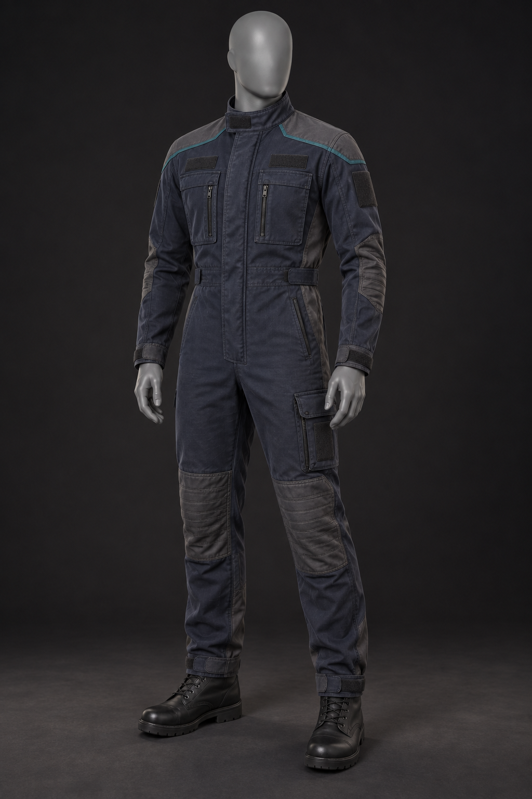

# Standard Crew Duty Uniform

## Status

User-approved standard crew uniform for the original webseries project.

## Design

The uniform combines a streamlined duty-coverall silhouette, clean professional shoulder and side-panel tailoring, rugged utility reinforcement, and restrained modern military practicality. Its graphite-navy body, charcoal reinforcement panels, muted deep-teal replaceable department-color channel, blank identification zones, articulated joints, practical pockets, and black duty boots establish the visual language for the project's crew equipment.

This is an original, franchise-neutral design. It intentionally contains no franchise emblems, national flags, real military insignia, readable text, weapons, or camouflage.

## Verified artifact

- File: `crew-uniform-photorealistic-concept.png`
- Dimensions: 1024 × 1536 pixels
- SHA-256: `358DC12418A4B5B4D1C0B2D05CF2F1E44EFF576765B4336E3F5DBB71DEB085E6`
- Approval: directly approved by the user in the originating Codex chat on 2026-10-05

## AI system attribution

- AI system/provider: Codex / OpenAI
- Product/interface: Codex desktop app
- Conversational model: GPT-5 (reported by the system; not independently verified)
- Image generator: OpenAI built-in image-generation tool; exact image-model identifier was not reported
- Task/session identity: withheld from this public repository for privacy; retained in private continuity records
- Chat title: unknown to the writing environment
- Execution environment: user's Windows workstation; private path omitted
- Generated and recorded: 2026-10-05, America/New_York
- Public repository record written: 2026-10-05 21:41:13 -04:00 (America/New_York); 2026-10-06 01:41:13Z
- Authority: direct user instruction to publish the approved concept as the crew uniform

## Production-requirement receipt

The concept records measured output dimensions, approval state, and public-safe provenance. Applicable intake requirements were HT02, HT06, HT07, HT12, and HT13 from `Jasoneagle/offline-ai-media-asset-pipeline` commit `d5a5c57eb3007b2206d6d15de687cd35c56f0d56`. No claim is made that this concept image is a fabrication pattern, material specification, engine-ready texture set, or final production costume.

