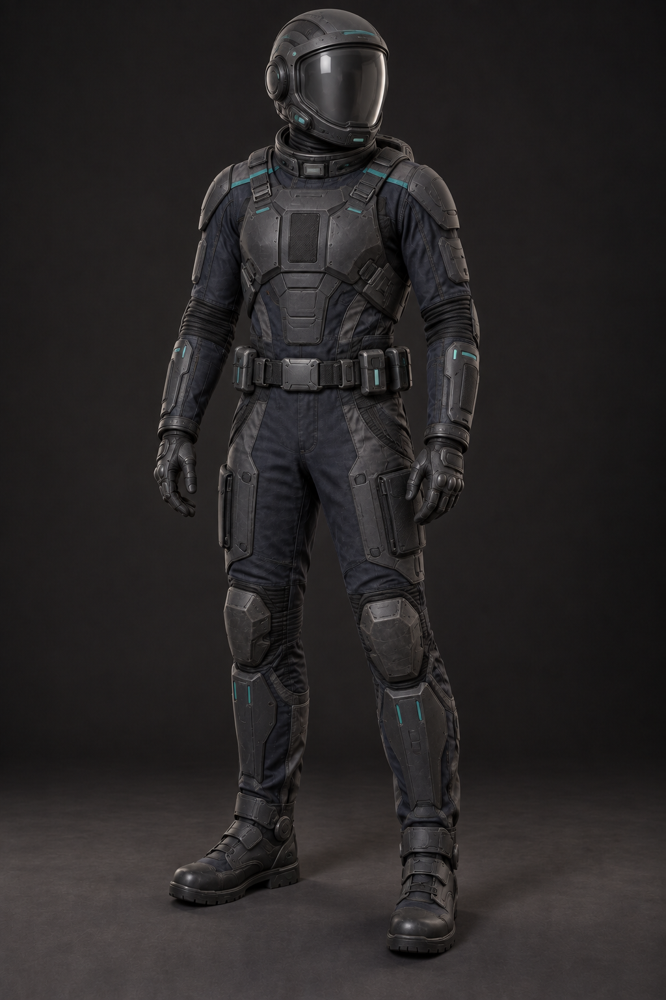

# Standard Armored Environmental Suit

## Status

User-approved standard space and environmental suit for the original webseries project.

## Design

This suit extends the crew duty uniform's graphite-navy, charcoal, and muted-teal visual language into a streamlined sealed pressure system. Low-profile overlapping armor, flexible protected joints, integrated gloves and boots, compact life support, and a sealed helmet allow it to serve as both environmental protection and light combat armor without becoming bulky.

The concept is original and franchise-neutral. It contains no franchise emblem, national flag, real military insignia, readable organization name, or existing company logo.

## Verified artifact

- File: `environmental-suit-armored-photorealistic-concept.png`
- Dimensions: 1024 × 1536 pixels
- SHA-256: `C7DA6E72255C0494F030E61B7D0672BF5EE41B077D0F96C7D36AD63FC3B7601E`
- Approval: directly approved by the user in the originating Codex chat on 2026-10-05

## AI system attribution

- AI system/provider: Codex / OpenAI
- Product/interface: Codex desktop app
- Conversational model: GPT-5 (reported by the system; not independently verified)
- Image generator: OpenAI built-in image-generation tool; exact image-model identifier was not reported
- Task/session identity: withheld from this public repository for privacy; retained in private continuity records
- Chat title: unknown to the writing environment
- Execution environment: user's Windows workstation; private path omitted
- Generated and approved: 2026-10-05, America/New_York
- Public repository record written: 2026-10-05 22:08:37 -04:00 (America/New_York); 2026-10-06 02:08:37Z
- Authority: direct user instruction to approve and save all current uniform concepts

## Production-requirement receipt

The concept records measured output dimensions, approval state, and public-safe provenance. Applicable intake requirements were HT02, HT06, HT07, HT12, and HT13 from `Jasoneagle/offline-ai-media-asset-pipeline` commit `d5a5c57eb3007b2206d6d15de687cd35c56f0d56`. This image is a visual concept, not a certified pressure-garment pattern, armor specification, or engine-ready asset.
