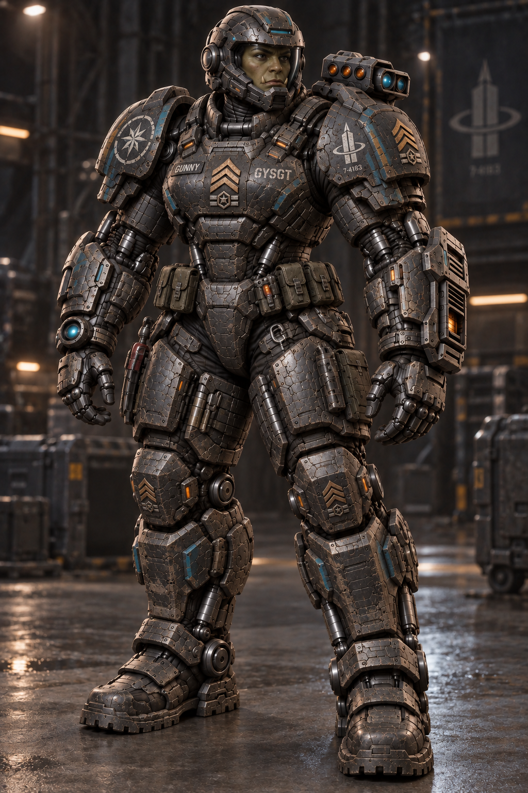

# Gunny's Career Personal-Tank Power Armor

## Status

User-approved custom power armor for Gunny, the webseries' female half-orc Gunnery Sergeant.

## Story and design

The company legally purchased this former Marine-service armor, but it has remained Gunny's personal suit throughout her career. Years of fitted replacement plating, repairs, upgraded actuators, practical gear placement, identification bands, and mismatched service parts make it a maintained working machine rather than factory-new equipment.

It functions as a personal tank: every body region is protected by rigid plating, flexible armored articulation, and powered joint structures. Integrated strength and movement augmentation supports heavy lifting, sprinting, climbing, kneeling, recoil management, and stable firing. Its weapons are built into the forearm, shoulder, and gauntlet systems.

The suit retains Gunny's rank and career identity through an original fictional rank device, `GUNNY` nameplate, `GYSGT` stencil, fictional navigation-star service badge, and fictional geometric company-transfer mark. These are production-original symbols. The concept does not use the real U.S. Marine Corps emblem, crossed-rifle rank insignia, a national flag, or an existing company logo.

## Verified artifact

- File: `gunny-career-personal-tank-power-armor-photorealistic-concept.png`
- Dimensions: 1024 × 1536 pixels
- SHA-256: `F75AE9517EDF9F65E8928086005EF3182D924BF66BF2AA3A0047D83BB7AD16CC`
- Approval: directly approved by the user in the originating Codex chat on 2026-10-05

## AI system attribution

- AI system/provider: Codex / OpenAI
- Product/interface: Codex desktop app
- Conversational model: GPT-5 (reported by the system; not independently verified)
- Image generator: OpenAI built-in image-generation tool; exact image-model identifier was not reported
- Task/session identity: withheld from this public repository for privacy; retained in private continuity records
- Chat title: unknown to the writing environment
- Execution environment: user's Windows workstation; private path omitted
- Generated and approved: 2026-10-05, America/New_York
- Public repository record written: 2026-10-05 22:08:37 -04:00 (America/New_York); 2026-10-06 02:08:37Z
- Authority: direct user instruction to approve and save all current uniform concepts

## Production-requirement receipt

The concept records measured output dimensions, approval state, fictional-species anatomy intent, and public-safe provenance. Applicable intake requirements were HT01, HT02, HT06, HT07, HT10, HT12, and HT13 from `Jasoneagle/offline-ai-media-asset-pipeline` commit `d5a5c57eb3007b2206d6d15de687cd35c56f0d56`. This image is a visual concept, not a fabrication drawing, weapons specification, real military procurement record, or engine-ready asset.
